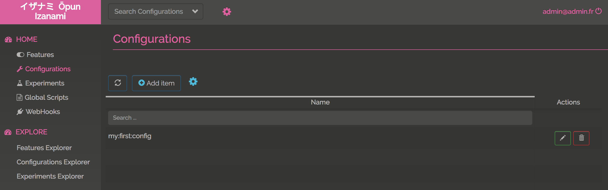

# The UI

You can access to the configurations clicking "configurations" on the left menu. 

You can then 

* Search using a pattern on configuration key 
* add a configuration
* update a configuration
* delete a configuration

If you're admin, you can also
 
* Download configurations 
* Upload configurations 

## Edit a configuration 

Add or Update a config is really simple. Configs are just key / value pairs where the value is a regular json (text, number, array or object). 

## Evaluate configs

You can evaluate configs as a tree using the explorer : 

In this example, we've search configs filtering on pattern `*first*`. The results is tree where key are expended and configs are merge in a json object. 

