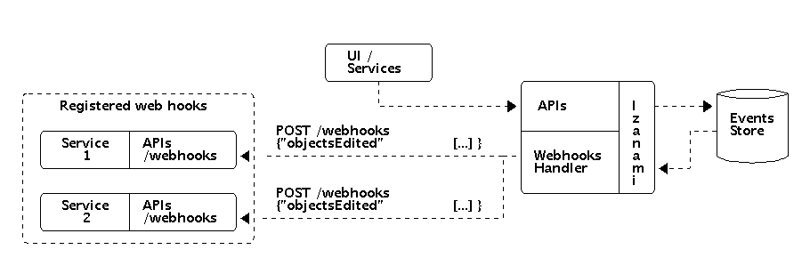

# Listen to events

Izanami provide a way to listen what is happening inside. There is two to achieve that : 

* SSE 
* Webhooks  

## Events model 

An event is json with the following structure : 

```json
{
  "_id": 942711288101863450,
  "type": "CONFIG_UPDATED",
  "key": "demo:title",
  "domain": "Config",
  "payload": {
    "id": "demo:title",
    "value": "{\n \"title\": \"Changed title\"\n}"
  },
  "oldValue": {
    "id": "demo:title",
    "value": "{\n \"title\": \"Title\"\n}"
  },
  "timestamp": "2017-12-18T11:01:00.469"
}	
```

| Field       | Description                                                    |
|-------------|----------------------------------------------------------------|
| `_id`       | Unique id of the event. A recent id is greater than a previous |
| `type`      | The type of the event (see the chapter below)                  |
| `key`       | The key of the modified object.                                |
| `domain`    | The domain concerned by the event (see the chapter below)      |
| `payload`   | The json of the updated object                                 |
| `oldValue`  | The oldValue is optional and only present during an update.    |
| `timestamp` | The timestamp of the event                                     |


The field `oldValue` is optional and only present during an update. 

### Domains 

| Domain     | Description                                             |
|------------|---------------------------------------------------------|
|Experiment  | Events from experiments, bindings and experiment events | 
|ApiKey      | Events from api keys                                    |
|Config      | Events from configs                                     |
|Feature     | Events from features                                    |   
|User        | Events from users                                       |      
|Script      | Events from scripts                                     |    
|Webhook     | Events from web hooks                                   |


### Types

|Types                              | Description                         |
|-----------------------------------|-------------------------------------|
|`CONFIG_CREATED`                   | When a config is created            |
|`CONFIG_UPDATED`                   | When a config is updated            |
|`CONFIG_DELETED`                   | When a config is deleted            |
|`CONFIGS_DELETED`                  | When configs are deleted            |
|`FEATURE_CREATED`                  | When a feature is created           |
|`FEATURE_UPDATED`                  | When a feature is updated           |
|`FEATURE_DELETED`                  | When a feature is deleted           |
|`FEATURES_DELETED`                 | When features are deleted           |
|`GLOBALSCRIPT_CREATED`             | When a global script is created     |
|`GLOBALSCRIPT_UPDATED`             | When a global script is updated     |
|`GLOBALSCRIPT_DELETED`             | When a global script is deleted     |
|`GLOBALSCRIPTS_DELETED`            | When global scripts are deleted     |
|`USER_CREATED`                     | When a user is created              |
|`USER_UPDATED`                     | When a user is updates              |
|`USER_DELETED`                     | When a user is deleted              |
|`USERS_DELETED`                    | When users are deleted              |
|`WEBHOOK_CREATED`                  | When a webhook is created           |
|`WEBHOOK_UPDATED`                  | When a webhook is updated           |
|`WEBHOOK_DELETED`                  | When a webhook is deleted           |
|`WEBHOOKS_DELETED`                 | When webhooks are deleted           |
|`APIKEY_CREATED`                   | When an apikey is created           |
|`APIKEY_UPDATED`                   | When an apikey is updated           |
|`APIKEY_DELETED`                   | When an apikey is deleted           |
|`APIKEYS_DELETED`                  | When apikeys are created            |
|`EXPERIMENT_CREATED`               | When an experiment is created       |
|`EXPERIMENT_UPDATED`               | When an experiment is updated       |
|`EXPERIMENT_DELETED`               | When an experiment is deleted       |
|`EXPERIMENTS_DELETED`              | When experiments are deleted        |
|`VARIANT_BINDING_CREATED`          | When an binding is created          |
|`EXPERIMENT_VARIANT_EVENT_CREATED` | When an experiment event is created |
|`EXPERIMENT_VARIANT_EVENT_DELETED` | When an experiment event is deleted |

## Web hooks 



Web hooks allow you to get notified when events occured in izanami. You have to register an endpoint in izanami, 
the endpoint needs to be a POST api handling a json payload of the form : 

```json
{
  "objectsEdited": [
    {...}, 
    {...}
  ]
}
``` 

If the call to the registered endpoint failed too much, the registered web hook will be deactivated. 

## Server sent event

Server sent event allow the server to push event to a client. The server keep a connection opened to send notifications. 
The [Server-Sent Events](https://en.wikipedia.org/wiki/Server-sent_events) EventSource API is standardized as part of [HTML5](https://en.wikipedia.org/wiki/HTML5) by the [W3C](https://en.wikipedia.org/wiki/World_Wide_Web_Consortium).

Izanami expose server sent events endpoint to listen what is happening. 
There is two endpoint: 

* `/api/events?domains=Config,Feature&patterns=*` : a global listener
* `/api/events/Config?patterns=*` : a listener for a specific domain


```bash
curl -X GET \
  'http://localhost:9000/api/events?domains=Config,Feature&patterns=*' \
  -H 'Content-Type: application/json' \
  -H 'Izanami-Client-Id: xxxx' \
  -H 'Izanami-Client-Secret: xxxx' 
```

Will return 

```
id: 942740804979392517
data: {"_id":942740804979392517,"type":"FEATURE_UPDATED","key":"drop:hbomb:in:random:place","domain":"Feature","payload":{"id":"drop:hbomb:in:random:place","enabled":false,"parameters":{"releaseDate":"11/01/2018 09:58:00"},"activationStrategy":"RELEASE_DATE"},"timestamp":"2017-12-18T13:58:17.841","oldValue":{"id":"drop:hbomb:in:random:place","enabled":false,"parameters":{"releaseDate":"11/01/2018 09:58:00"},"activationStrategy":"RELEASE_DATE"}}
```

### Replay Events 

If you're using kafka as a data store for events, you can replay events from the last day using the `Last-Event-Id` header. 

With this request, the event after the id `942740804979392517` will be replayed. 

```bash
curl -X GET \
  'http://localhost:9000/api/events?domains=Config,Feature&patterns=*' \
  -H 'Content-Type: application/json' \
  -H 'Izanami-Client-Id: xxxx' \
  -H 'Izanami-Client-Secret: xxxx' \
  -H 'Last-Event-Id: 942740804979392517' 
```

The replay can be used for failure handling while listening to events. 
If the client lose the connection or crash, it can specify the last event id to get the event that append since the failure.  

