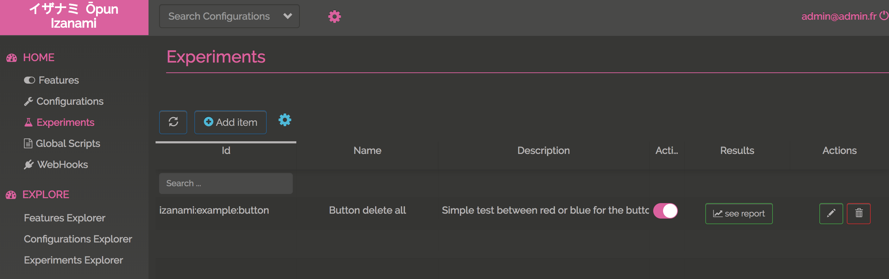
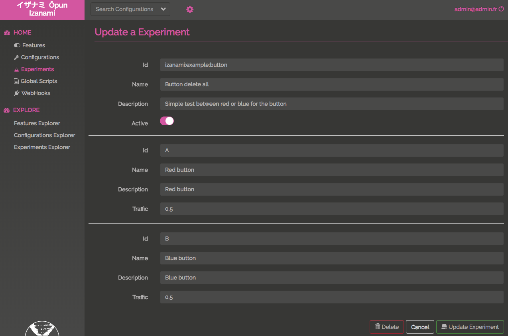
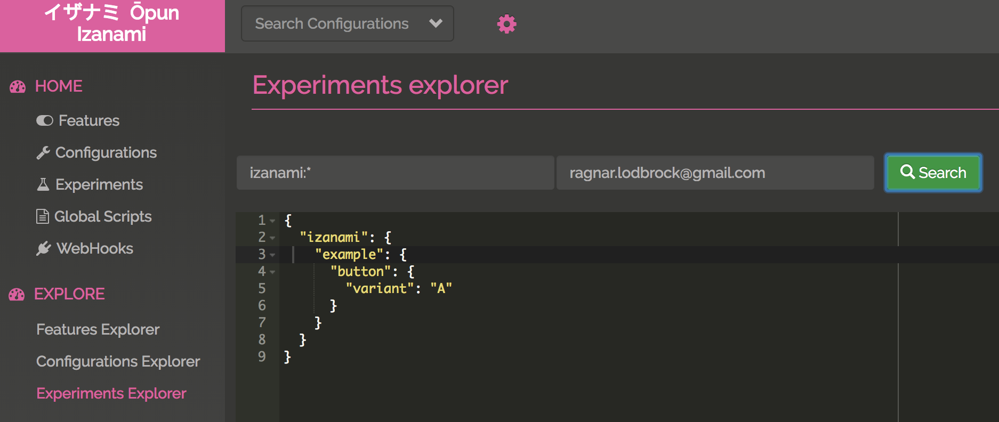
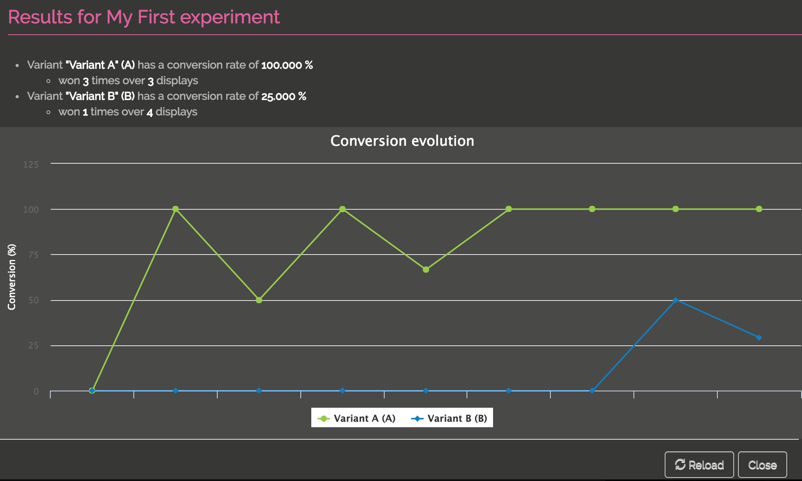

# The UI

You can access to the experiments clicking "experiments" on the left menu. 

You can then 

* Search using a pattern on experiment key 
* add a experiment
* update a experiment
* delete a experiment

If you're admin, you can also
 
* Download experiments 
* Upload experiments 

## Edit a experiment 

Add or Update an experiment is really simple on the UI.   

## Evaluate experiments

The explorer allows you to find which variant is associated to a user:  

In this example, we've search experiments filtering on pattern `izanami:*` and for the user `ragnar.lodbrock@gmail.com`. 

The variant associated to this user is the A variant.

## Consult the results 

You can consult which is the winning variant clicking the `See report` button.

## Download and Upload

* TODO 