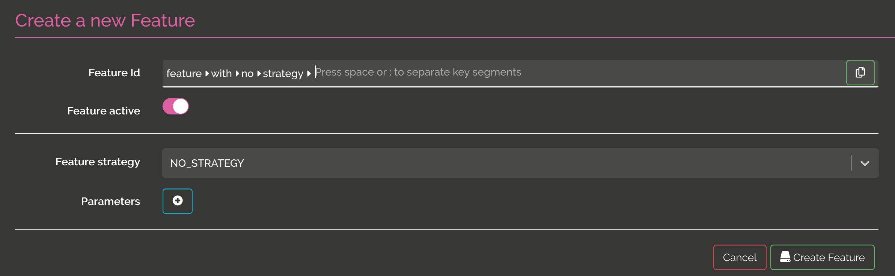

# Feature flipping  

@@@ index

 * [APIs](api.md)
 * [UI](ui.md)

@@@ 

@@toc { depth=2 }

One of the main feature of Izanami is feature flipping. Feature flipping allow you to activate or passivate a feature in real time. 

The clients can check if a feature is active using the REST API. 

When you create a feature, you have to select a strategy. You can choose between NO_STRATEGY, RELEASE_DATE, SCRIPT or GLOBAL_SCRIPT

## NO_STRATEGY 

this is the simpler one, the feature can be active or inactive

  
## RELEASE_DATE 

this kind of strategy allow you to enable a feature on a date value in addition to the active boolean.  

## SCRIPT 

this kind of strategy allow you to enable a feature using a script execution. On json context should be posted to evaluate if the feature is active or not. 

In this example, the feature is active if the user send in the context is `ragnar.lodbrock@gmail.com` : 

## GLOBAL SCRIPT 

Global script strategy is the same as script except that the script are shared between features. 