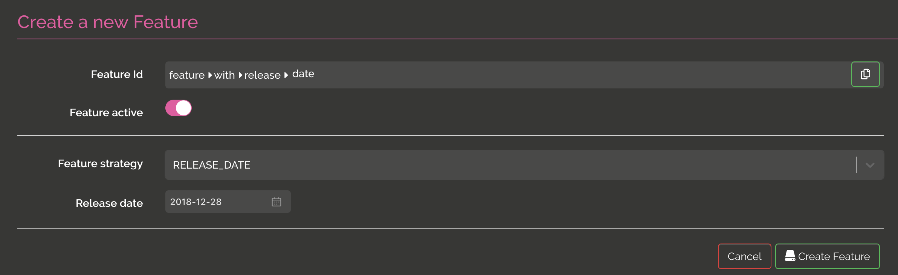
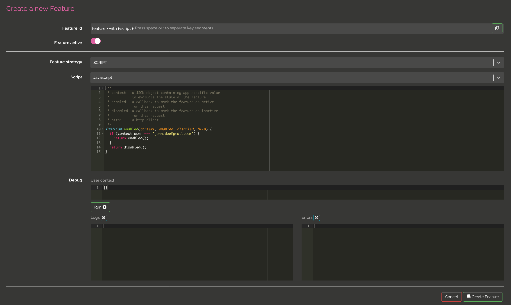

# Feature flipping  


@@@ index

 * [UI](ui.md)
 * [APIs](api.md)

@@@ 

@@toc { depth=3 }

One of the main feature of Izanami is feature flipping. Feature flipping allow you to activate or passivate a feature in real time. 

The clients can check if a feature is active using the REST API. 

When you create a feature, you have to select a strategy. You can choose between NO_STRATEGY, RELEASE_DATE, SCRIPT or GLOBAL_SCRIPT

## NO_STRATEGY 

this is the simpler one, the feature can be active or inactive


  
## RELEASE_DATE 

this kind of strategy allow you to enable a feature on a date value in addition to the active boolean.  



  
## DATE_RANGE 

this kind of strategy allow you to enable a feature on a range of dates in addition to the active boolean.  


## PERCENTAGE

this kind of strategy allow you to enable a feature for a percentage of clients. In this strategy, the client need to send a context with an `id` field in order to calculate if the feature is enabled or not. 


## SCRIPT 

this kind of strategy allow you to enable a feature using a script execution. On json context should be posted to evaluate if the feature is active or not. 

In this example, the feature is active if the user sent in the context is `ragnar.lodbrock@gmail.com` : 



When writing a script, you have access to 

* `context`: A json object send by the client 
* `enabled`: A function to call, the feature is enabled
* `disabled`: A function to call, the feature is disabled
* `http`: An http client that can be used to request an API.  

The http client expose the call method that take two args :
 
* `options`, an object with the following possible attributes 
    * `url` (required): The url to call. 
    * `method` (default get): The http method betwwen `get`, `post`, `put`, `delete`, `option`, `patch`
    * `headers` : A object with headerName -> Value 
    * `body` : An optional json string
* `callback`: A bifunction with failure or success. 

```javascript
function enabled(context, enabled, disabled, http) {
    http.call({
      url: "http://localhost:9000/api/features/feature:with:script/check", 
      method: "post", 
      headers: {
        "Izanami-Client-Id": "xxxx",
        "Izanami-Client-Secret": "xxxx", 
        "Content-Type": "application/json"
      }, 
      body: JSON.stringify({
        user: context.user
      })
    }, 
    function (error, success) {
      if (error) {
        return enabled()
      } else {
        var resp = JSON.parse(success)
        if (resp.active) {
          return enabled(); 
        } else {
          return disabled();
        }
      }
    }
  )
}
```


## GLOBAL SCRIPT 

Global script strategy is the same as script except that the script are shared between features. 

You can find more details about global scripts @ref[on this page](../ui.md#create-or-update-a-script).

