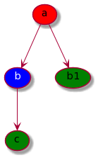

# Lock path

With _Lock_, a tree structure can be frozen. The idea is to place locks on nodes to freeze certain branches of tree and allow only the modification of nodes / leaves upstream of the locks.

When a node is locked :

- certain features can be created upstream of the lock
- the creation is forbidden downstream of the lock
- the lock has no effect in another branch of tree

Lock and _authorized patterns_ ( @ref[cf. UI guide ](../ui.md#edit-a-user) ) does not have a same target :

- lock : freeze a branch of tree
- authorized patterns : grant permissions (CRUD) to features 

## UI

@ref[Tree mode](ui.md#tree-mode) must be used to manage locks. And only **admin** user can add / remove lock. 

## Example

Let's go for a schema :

This tree is a representation of 2 features :

- a:b:c
- a:b1

A lock is activated on the **b** :

- a feature can be created from **b**, **c**, because **b**, **c** is upstream or equals of **b** 
- a feature can't be created from **a**, because **a** is downstream to **b**
- **b** can be deleted / moved
- a lock has no effect on **b1**, because it's not a same branch