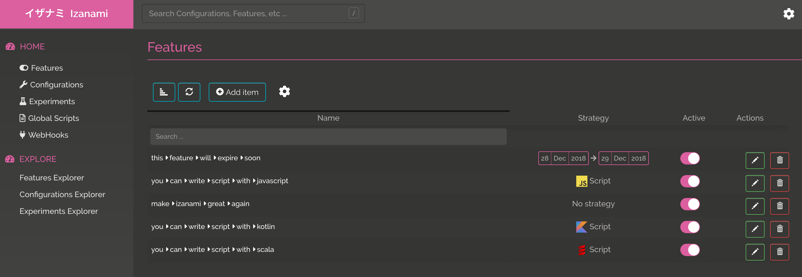
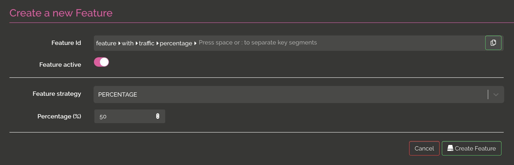

# The UI

You can access to the features clicking "features" on the left menu. 

You can then 

* Search using a pattern on feature key 
* add a feature 
* update a feature 
* delete a feature

If you're admin, you can also
 
* Download features 
* Upload features 

## Edit a feature  

When you create a feature, you have to select a strategy. You can choose between NO_STRATEGY, RELEASE_DATE, DATE_RANGE, PERCENTAGE, SCRIPT or GLOBAL_SCRIPT

### NO_STRATEGY 

this is the simpler one, the feature can be active or inactive

  
### RELEASE_DATE 

this kind of strategy allow you to enable a feature on a date value in addition to the active boolean.  

### DATE_RANGE 

this kind of strategy allow you to enable a feature on a range of dates in addition to the active boolean.  

### PERCENTAGE

this kind of strategy allow you to enable a feature for a percentage of clients. In this strategy, the client need to send a context with an `id` field in order to calculate if the feature is enabled or not. 

### SCRIPT 

this kind of strategy allow you to enable a feature using a script execution. On json context should be posted to evaluate if the feature is active or not. 

In this example, the feature is active if the user send in the context is `ragnar.lodbrock@gmail.com` : 

You can find more details about script @ref[on this page](./index.md#script).

### GLOBAL SCRIPT 

Global script strategy is the same as script except that the script are shared between features. 

## Evaluate a feature 

You can evaluate if a feature is active or with the explorer screen. 

In this example, we have specified a pattern `*:script` to filter the feature. 

We have also specified a context to test the feature. The tested feature is a feature with a "script" strategy so we want to be sure that the script is correct.   

## Download and Upload

If you're admin you have the right to download or upload. 

