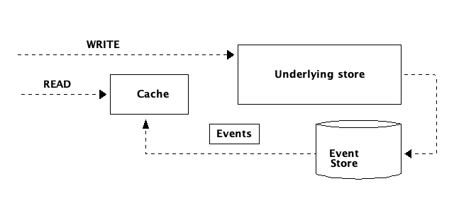

# Choose the database 

@@toc { depth=3 }

Izanami provide an integration with several databases : 

* Level DB (by default)
* In memory 
* Redis 
* Cassandra 
* Elastic search 

It's possible to choose one database for the whole Izanami instance or choose a database par datatype (for example Elasticsearch for A/B testing and Redis for all the rest)

Izanami can handle event with :

* An in memory store  
* Redis with pub / sub 
* Kafka 
* Akka distributed pub / sub 

@@@ warning 
The in memory event store does not work with a cluster of izanami instance. 
@@@


## Databases 

### In memory store 

The in memory store all data in memory using an hashmap.   

@@@ warning 
The in memory store should be used for trial purpose and is not suited for production usage. 
@@@


```bash
bin/izanami -Dizanami.db.default=InMemory
```

Or 

```bash
export IZANAMI_DATABASE=InMemory 
bin/izanami 
```

### Level DB 

Level DB is key / value store developed by google. The datas are stored on a the local file system.    

@@@ warning 
Level DB store should be used for trial purpose and is not suited for production usage. 
@@@

```bash
bin/izanami -Dizanami.db.default=LevelDB -D-Dizanami.db.leveldb.parentPath=/datas
```

Or 

```bash
export IZANAMI_DATABASE=LevelDB 
export LEVEL_DB_PARENT_PATH=/datas
bin/izanami 
```

### Redis 

<a src="https://redis.io/" target="_blanck">Redis</a> is an very fast in memory data store. 

To run Izanami with redis : 

```bash
bin/izanami \ 
    -Dizanami.db.default=Redis \
    -D-Dizanami.db.redis.host=localhost \
    -D-Dizanami.db.redis.port=6379 \  
    -D-Dizanami.db.redis.password=xxxx 
```

Or 

```bash
export IZANAMI_DATABASE=Redis
export REDIS_HOST=localhost 
export REDIS_PORT=6379
export REDIS_PASSWORD=xxxx

bin/izanami 
```

#### redis sentinel 

```bash
bin/izanami \ 
    -Dizanami.db.default=Redis \
    -Dizanami.db.redis.type=sentinel \
    -D-Dizanami.db.redis.host=localhost \    
    -Dizanami.db.redis.port=26379 \
    -Dizanami.db.redis.masterId=redismaster \
    -Dizanami.db.redis.sentinels.0.host=localhost \
    -Dizanami.db.redis.sentinels.0.port=26380 \
    -Dizanami.db.redis.password=xxxx 
```

Or 

```bash
export IZANAMI_DATABASE=Redis
export REDIS_HOST=localhost 
export REDIS_PORT=26379
export REDIS_MASTER_ID=redismaster
export REDIS_PASSWORD=xxxx

bin/izanami 
```


Other settings are available, consult the @ref[settings](settings.md) page. 


### Cassandra 

<a src="http://cassandra.apache.org/" target="_blanck">Cassandra</a> is an very scalable column data store. 
You can use this database if you need strong availability or if you have a huge amount of datas (for example A/B testing scenarios with a lot end users).   

To run Izanami with cassandra : 

```bash
bin/izanami \ 
    -Dizanami.db.default=Cassandra \
    -D-Dizanami.db.cassandra.host=localhost \
    -D-Dizanami.db.cassandra.port=9042  
```

Or 

```bash
export IZANAMI_DATABASE=Cassandra
export CASSANDRA_HOST=localhost 
export CASSANDRA_PORT=9042

bin/izanami 
```

Other settings are available, consult the @ref[settings](settings.md) page. 


### Elasticsearch 

<a src="https://www.elastic.co/" target="_blanck">Elasticsearch</a> is an very scalable search engine. 
This database if well suited for storing A/B testing events.   

To run Izanami with elasticsearch : 

```bash
bin/izanami \ 
    -Dizanami.db.default=Elastic \
    -D-Dizanami.db.elastic.host=localhost \
    -D-Dizanami.db.elastic.port=9200 \  
    -D-Dizanami.db.elastic.user=xxxx \
    -D-Dizanami.db.elastic.password=xxxx
```

Or 

```bash
export IZANAMI_DATABASE=Elastic
export ELASTIC_HOST=localhost 
export ELASTIC_PORT=9200
export ELASTIC_USER=xxxx
export ELASTIC_PASSWORD=xxxx

bin/izanami 
```

Other settings are available, consult the @ref[settings](settings.md) page. 

### Mongo 


To run Izanami with mongo : 

```bash
bin/izanami \ 
    -Dizanami.db.default=Mongo \
    -Dizanami.db.mongo.url=mongodb://localhost:27017/izanami
```

Or 

```bash
export IZANAMI_DATABASE=Mongo
export MONGODB_ADDON_URI=mongodb://localhost:27017/izanami 

bin/izanami 
```

Other settings are available, consult the @ref[settings](settings.md) page. 

### AWS DynamoDB 


To run Izanami with DynamoDB : 

```bash
bin/izanami \ 
    -Dizanami.db.default=Dynamo \
    -Dizanami.db.dynamo.region=eu-west-1
    -Dizanami.db.dynamo.accessKey=xxxxx
    -Dizanami.db.dynamo.secretKey=xxxxx
```

Or 

```bash
export IZANAMI_DATABASE=dynamo
export DYNAMO_REGION=eu-west-1
export DYNAMO_ACCESS_KEY=xxxxxxx
export DYNAMO_SECRET_KEY=xxxxxxx

bin/izanami 
```

If the credentials are not set in the configuration, connector will use the default credential provider chain provided by the DynamoDB Java SDK to retrieve credentials.

Izanami requires the following [IAM permissions](https://docs.aws.amazon.com/amazondynamodb/latest/developerguide/api-permissions-reference.html) :

* dynamodb:DeleteItem
* dynamodb:GetItem
* dynamodb:PutItem
* dynamodb:Query
* dynamodb:UpdateItem
* dynamodb:BatchWriteItem 
* dynamodb:DescribeTable

Additionally if the DynamoDB tables don't already exist, Izanami will create them for you which will require 
the `dynamodb:CreateTable` permission.

You can create them with the following commands
```bash
aws dynamodb create-table --table-name izanami --attribute-definitions AttributeName=store,AttributeType=S AttributeName=id,AttributeType=S  --key-schema AttributeName=store,KeyType=HASH AttributeName=id,KeyType=RANGE --provisioned-throughput ReadCapacityUnits=1,WriteCapacityUnits=1
aws dynamodb create-table --table-name izanami_experimentevent --attribute-definitions AttributeName=experimentId,AttributeType=S AttributeName=variantId,AttributeType=S  --key-schema AttributeName=experimentId,KeyType=HASH AttributeName=variantId,KeyType=RANGE --provisioned-throughput ReadCapacityUnits=1,WriteCapacityUnits=1
```

Other settings are available, consult the @ref[settings](settings.md) page. 

### In Memory with Db 

If your data fit in memory and you need high throughput you can use this store. 

With this store your data are kept in memory and used for read operations. 
During write operations, the in memory image is updated asynchronously. 




To run Izanami with in memory with db : 

```bash
bin/izanami \ 
    -Dizanami.db.default=InMemoryWithDb \
    -Dizanami.db.inMemoryWithDb.db=Mongo \
    -Dizanami.db.inMemoryWithDb.pollingInterval=1 second \  // If you need to force a periodic refresh of your cache 
    -Dizanami.db.mongo.url=mongodb://localhost:27017/izanami
```

Or 

```bash
export IZANAMI_DATABASE=InMemoryWithDb
export IN_MEMORY_WITH_DB_DB=Mongo
export MONGODB_ADDON_URI=mongodb://localhost:27017/izanami 
export IN_MEMORY_WITH_DB_POLLING_INTERVAL=1 second // If you need to force a periodic refresh of your cache 

bin/izanami 
```

You can set a database per domain : 

```bash
bin/izanami \ 
    -Dizanami.db.default=InMemoryWithDb \
    -Dizanami.db.inMemoryWithDb.db=Mongo \
    -Dizanami.db.inMemoryWithDb.pollingInterval=1 second \  // If you need to force a periodic refresh of your cache 
    -Dizanami.db.mongo.url=mongodb://localhost:27017/izanami \
    -Dizanami.feature.db.conf.db.type=Elastic       // Override underlying db for features
```


### Mix Databases 

If you want to use 2 or more databases you need to provide
 
* The connection settings for each DB 
* The database associated to a domain 

For example, use redis for all except the A/B testing events stored in ES : 


```bash
bin/izanami \ 
    -Dizanami.db.default=Redis \
    -Dizanami.db.redis.host=localhost \
    -Dizanami.db.redis.port=6379 \  
    -Dizanami.db.redis.password=xxxx \
    -Dizanami.db.elastic.host=localhost \
    -Dizanami.db.elastic.port=9200 \  
    -Dizanami.db.elastic.user=xxxx \
    -Dizanami.db.elastic.password=xxxx \
    -Dizanami.variantBinding.db.type=Elastic \
    -Dizanami.experimentEvent.db.type=Elastic
```

Or 

```bash
export IZANAMI_DATABASE=Redis
export REDIS_HOST=localhost 
export REDIS_PORT=6379
export REDIS_PASSWORD=xxxx
export ELASTIC_HOST=localhost 
export ELASTIC_PORT=9200
export ELASTIC_USER=xxxx
export ELASTIC_PASSWORD=xxxx
export EXPERIMENT_VARIANT_BINDING_DATABASE=Elastic
export EXPERIMENT_EVENT_DATABASE=Elastic

bin/izanami 
```

Other settings are available, consult the @ref[settings](settings.md) page. 

## Event stores 

The event store is essentially used for server sent event. Server sent event is used for real time server push notifications.  


### In memory 

With this config, the events are emitted in memory using akka eventStream. This is the default configuration.
 
@@@ warning 
The memory event store should not be used in a clustered environment as the events are local to each node.    
@@@

```bash
bin/izanami \ 
    -Dizanami.events.store=InMemory
```

Or 

```bash
export IZANAMI_EVENT_STORE=InMemory

bin/izanami 
```
 
 
### Redis pub sub

The redis event store use the <a href="https://redis.io/topics/pubsub" target="_blanck">redis pub / sub</a>.  

This event store could be useful if you run multiple instance of izanami and already use redis as database but this solution is not robust.  

```bash
bin/izanami \ 
    -Dizanami.events.store=Redis
    -D-Dizanami.db.redis.host=localhost \
    -D-Dizanami.db.redis.port=6379 \  
    -D-Dizanami.db.redis.password=xxxx 
```

Or 

```bash
export IZANAMI_EVENT_STORE=Redis
export REDIS_HOST=localhost 
export REDIS_PORT=6379
export REDIS_PASSWORD=xxxx

bin/izanami 
```

Other settings are available, consult the @ref[settings](settings.md) page. 

 
### Kafka  

The <a href="https://kafka.apache.org/" target="_blanck">Kafka</a> event store is the recommended event store.   

```bash
bin/izanami \ 
    -Dizanami.events.store=Kafka
    -D-Dizanami.db.kafka.host=localhost \
    -D-Dizanami.db.kafka.port=9092 \      
```

Or 

```bash
export IZANAMI_EVENT_STORE=Kafka
export KAFKA_HOST=localhost 
export KAFKA_PORT=6379

bin/izanami 
```

Other settings are available, consult the @ref[settings](settings.md) page. 


### Distributed pub sub  

The distributed pub / sub use akka distributed pub sub. To use this store you need to form a <a href="https://doc.akka.io/docs/akka/snapshot/cluster-usage.html" target="_blanck" >akka cluster</a> between each nodes. 


```bash
#Instance 1    
bin/izanami \     
    -Dizanami.events.store=Distributed \     
    -Dcluster.akka.remote.netty.tcp.port=2551 \ 
    -Dcluster.akka.remote.seed-nodes.0=akka.tcp://DistributedEvent@127.0.0.1:2551
    
#Instance 2    
bin/izanami \
    -Dhttp.port=9001 \
    -Dizanami.events.store=Distributed \     
    -Dcluster.akka.remote.netty.tcp.port=2552 \ 
    -Dcluster.akka.remote.seed-nodes.0=akka.tcp://DistributedEvent@127.0.0.1:2551     
```

Or 

```bash
#Instance 1    
export IZANAMI_EVENT_STORE=Distributed
export AKKA_CLUSTER_PORT=2551
export AKKA_CLUSTER_SEED_NODE_HOST=127.0.0.1
export AKKA_CLUSTER_SEED_NODE_PORT=2551
bin/izanami 

#Instance 2
export HTTP_PORT=9001
export IZANAMI_EVENT_STORE=Distributed
export AKKA_CLUSTER_PORT=2552
export AKKA_CLUSTER_SEED_NODE_HOST=127.0.0.1
export AKKA_CLUSTER_SEED_NODE_PORT=2551
bin/izanami 
```

Other settings are available, consult the @ref[settings](settings.md) page. 