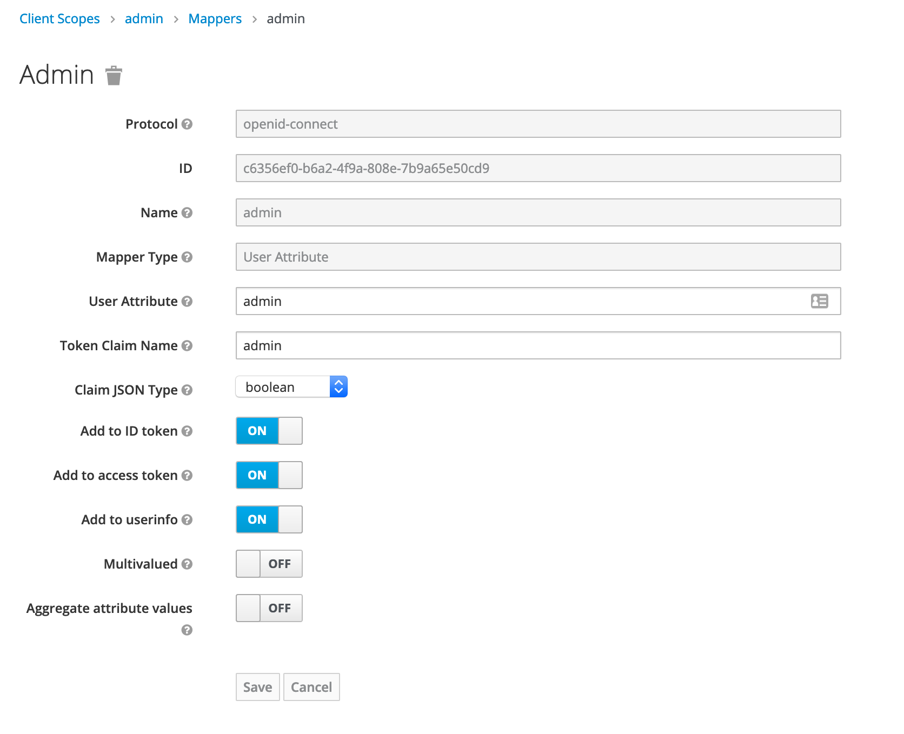

# Oauth2 with keycloak 

@@toc { depth=3 } 

This tutorial show how to delegate user authentication to keycloak using oauth2. 

On keycloak, you'll need to 
 * define scope for custom field 
 * set a dedicated client for Izanami 
 * add scope to client 
 * create users with custom attributes 
 * Configure Izanami 

## Running keycloak 

Just use docker : 

``` 
docker-compose -f docker-compose.oauth.yml up 
```

Go to `http://localhost:8980` and log with `izanami` / `izanami`.  
 
## Define scope 

You first need to define new scopes for 
 * `authorizedPatterns` : the pattern applied on keys that the user is able to use 
 * `admin` : a boolean to define id the user will be admin

### Define a new scope for authorized patterns field


 
 ### Define a mapper for authorized patterns field

Define a mapper for the `authorizedPatterns` field with a mapper type `UserAttribute` and the name of the attribute and the name in the claim. 
Here the name will be `authorizedPatterns` and the type in json will be a `string`.

 

### Define a new scope for the admin field

 

### Define a mapper for the admin field

Define a mapper for the `admin` field with a mapper type `UserAttribute` and the name of the attribute and the name in the claim. 
Here the name will be `admin` and the type in json will be a `boolean`.

 

## Create an Izanami client 

Create a new open id connect client and name it izanami. Set the root url to the url of your server. 

 

In the settings, fill the field with the various urls of izanami. 


In the client scope panel, add the two scopes created previously. 
 
 

Next step create some users.

## Create users 

We will create two users : 
 * one admin user 
 * one user with restricted access
 
In the users menu, add a new user 


### Admin user 

Create an admin user 


In the attributes panel, add two attributes 


### Random user 

Create an simple user 


In the attributes panel, add the restriction pattern 


## Configure izanami 

Assuming that keycloak was started on `8980` port you can set the following configuration : 

```
  oauth2 {
    enabled = true
    authorizeUrl = "http://localhost:8980/auth/realms/master/protocol/openid-connect/auth"
    tokenUrl = 	"http://localhost:8980/auth/realms/master/protocol/openid-connect/token"
    userInfoUrl = "http://localhost:8980/auth/realms/master/protocol/openid-connect/userinfo"
    introspectionUrl = 	"http://localhost:8980/auth/realms/master/protocol/openid-connect/token/introspect"
    loginUrl = "http://localhost:8980/auth/realms/master/protocol/openid-connect/auth"
    logoutUrl = "http://localhost:8980/auth/realms/master/protocol/openid-connect/logout"
    clientId = "izanami"
    clientSecret = "secret"
    scope = "openid profile email name admin authorizedPatterns"    
    readProfileFromToken = true
    useCookie = false
    useJson = false
    idField = "sub"
    accessTokenField = "access_token"
    nameField = "preferred_username"
    emailField = "email"
    adminField = "admin"
    authorizedPatternField = "authorizedPatterns"
    defaultPatterns = ""
  }
```

Or with environment variables : 


```

```

Now if you hit the `http://localhost:9000` izanami homepage, you're redirected to the keycloak login page : 


Just set the admin credentials 

It's fine, the user has access to the api keys configuration, he is an admin. 


Retry but this time using the johndoe account 


The api keys configuration, he is not available anymore


And the user is not able to create a feature with a pattern he is not allowed 


