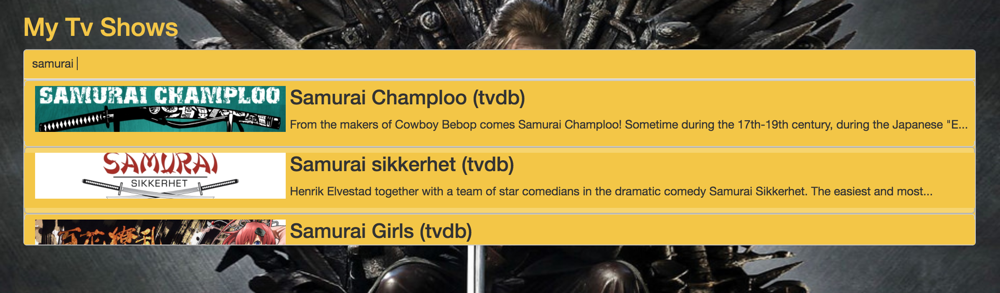
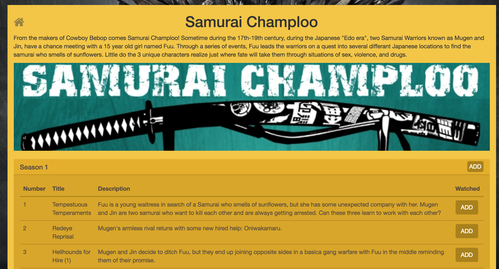

# Spring / React tutorial

@@toc { depth=3 } 

In this tutorial we're gonna see how to use Izanami in a springboot / react application. 

We're go to use the izanami-tryout (http://izanami-tryout.cleverapps.io) instance available online (thanks to [clever cloud](https://www.clever-cloud.com/)) to avoid running an instance on your machine.

@@@ warning
The "izanami-tryout" instance is reset frequently and should only be used to try Izanami and not for other purpose.  
@@@
  

## Overview of the example application 

This tutorial is based on an application that allow you to "mark as watched" the episodes of the tv shows you're watching. 

There is basically three big features in this app : 

* Search and select a tv show 
* Display the tv show you have selected 
* For a tv show, display seasons and episodes in order to mark the watched episodes


### Code organisation 

 
 

The code is organized as follow : 

* app : Global controller to serve the html and for login actions
* izanami : The proxy to the izanami server to expose izanami data to the client
* me : APIs and services concerning my tv shows and episodes  
* shows : APIs and services to search tv shows. Tv shows can come from multiple providers like tvdb or beta series. 
* Application.java : This is the root class of the application

### Running the application 

To run the application, you will need 

* JDK 8 : http://www.oracle.com/technetwork/java/javase/downloads/jdk8-downloads-2133151.html
* sbt : http://www.scala-sbt.org/download.html
* Node js : https://nodejs.org/en/download/ 
* Yarn : https://yarnpkg.com/lang/en/docs/install/ 

Let's start by cloning Izanami : 

```bash
git clone https://github.com/MAIF/izanami.git --depth=1
```

Then we have to compile and run the js/react code 

```
cd example/example-spring/javascript
yarn install 
yarn start 
```

Now there is a webpack server waiting to refresh the browser when the code change. 

Let's run the server side : 

```bash
sbt 'project example-spring' ';clean;~reStart'
```

Like on the client side, the server will be restarted automatically when your code will change. 

Now just open your browser and go to http://localhost:8080/

You can log with any email : 

 

Then search a show  



Select it 


Go to the episodes to add the watched ones 



## Step one : Configuring the java client 

To use Izanami, you first need to instantiate a client.

In this example, we're going to use the izanami tryout instance (http://izanami-tryout.cleverapps.io) deployed on [clever cloud](https://www.clever-cloud.com/).

The instance is configured on the `src/main/resources/application.yml` file : 

```yaml 
izanami:
  host: "http://izanami-tryout.cleverapps.io"
  clientId: "xxxx"
  clientSecret: "xxxx"
``` 

And the client is registered as spring bean like this : 

```java 
@SpringBootApplication
public class Application {

    @Autowired
    Environment environment;
    
    @Bean
    ActorSystem actorSystem() {
        return ActorSystem.create();
    }

    @Bean
    @Autowired
    IzanamiClient izanamiClient(ActorSystem actorSystem) {
        String host = environment.getProperty("izanami.host");
        String clientId = environment.getProperty("izanami.clientId");
        String clientSecret = environment.getProperty("izanami.clientSecret");
        LOGGER.info("Creating izanami client with host {}, client id {}", host, clientId);
        return IzanamiClient.client(
                    actorSystem,
                    ClientConfig
                        .create(host) // The url of the server 
                        .withClientId(clientId) // The client id of the api 
                        .withClientSecret(clientSecret) // The client secret of the api                    
                        .withDispatcher("izanami-example.blocking-io-dispatcher") // To handle blocking calls 
                        .sseBackend() // To be notified when there is change on the server 
                );
    }
}
```

The client is based on [Akka](https://akka.io/) so you have to provide an `ActorSystem` to make it work. 

Now we have to create a `FeatureClient` in order to use feature flipping. 

In this example we use two spring profiles 
* `izanamiLocal`: Use on fallback from config and never call the server. You can use it during development if you don't an available Izanami instance.   
* `izanamiProd` : This profile will use a real Izanami server instance.

So for `FeatureClient` we have two configs : 

```java 
    
    
    @Configuration
    @Profile("izanamiLocal")
    static class Dev {
        @Bean
        @Autowired
        FeatureClient featureClientDev(IzanamiClient izanamiClient, Environment environment) {
            String json = environment.getProperty("izanami.fallback.features");
            LOGGER.info("Loading feature fallback \n{}", json);
            return izanamiClient.featureClient(
                    Strategies.dev(), // The dev strategy use only fallback 
                    Features.parseJson(json)
            );
        }
    }
    
    @Configuration
    @Profile("izanamiProd")
    static class Prod {
        @Bean
        @Autowired
        FeatureClient featureClient(IzanamiClient izanamiClient, Environment environment) {
            return izanamiClient.featureClient(
                    Strategies.smartCacheWithSseStrategy("mytvshows:*"),
                    Features.parseJson(environment.getProperty("izanami.fallback.features"))
            );       
    }
```

The fallback is read from the config file : 

```yaml
izanami:
  // ...
  fallback:
    features: >
      [
        { "id": "mytvshows:season:markaswatched", "enabled": true },
        { "id": "mytvshows:providers:tvdb", "enabled": true },
        { "id": "mytvshows:providers:betaserie", "enabled": false },
        { "id": "mytvshows:providers:omdb", "enabled": false }
      ]
```

@@@ note

It's important to configure a fallback in case the server is not available. 

@@@


## Step two : feature flipping to switch the providers  

The application integrate multiple providers in order to search a tvshow. We want to be able to switch the providers for some reason. 

We will first define keys for each providers : 

* `mytvshows:providers:tvdb` : for tvdb 
* `mytvshows:providers:betaserie`: for betaserie
 
As you can see the keys are arborescent. We first have `mytvshows` to categorize the app then `providers` and then the name of the provider. 

This is a recommended pattern because
 
* it will facilitate the keys administration 
* it allows the application to keep track of updates while limiting the amount of datas.   

As seen in the previous chapter, the features are declared as fallback in configuration file. Now let's create this features on the server. 

Go to http://izanami-tryout.cleverapps.io/ and log in with `admin` / `admin123`. 

Click the "features" menu  


and add your keys :


Now your keys are created and enabled 


We have now to handle this in our application. The `ShowsApi` class exposes two methods : 

* search : to search a show 
* get : to get a show, this seasons and episodes

Let's inject, the `FeatureClient`, `TvdbShowsApi` (to dialog with tvdb) and `BetaSerieApi` (to dialog with betaseries) : 

```java
public class ShowsApi implements Shows {

    private final static Logger LOGGER = LoggerFactory.getLogger(ShowsApi.class);

    private final FeatureClient featureClient;

    private final TvdbShowsApi tvdbShowsApi;

    private final BetaSerieApi betaSerieApi;

    @Autowired
    public ShowsApi(FeatureClient featureClient, TvdbShowsApi tvdbShowsApi, BetaSerieApi betaSerieApi) {
        this.featureClient = featureClient;
        this.tvdbShowsApi = tvdbShowsApi;
        this.betaSerieApi = betaSerieApi;        
    }
    // ...
}
``` 

Now we can implement the `search` and `get` methods delegating the work on providers : 

```java
@Override
public List<ShowResume> search(String serie) {
    Features features = this.featureClient.features("mytvshows:providers:*").get();
    if (features.isActive("mytvshows:providers:tvdb")) {
        return tvdbShowsApi.search(serie);
    } else if (features.isActive("mytvshows:providers:betaserie")) {
        return betaSerieApi.search(serie);
    } else {
        return List.empty();
    }
}

@Override
public Option<Show> get(String id) {
    Features features = this.featureClient.features("mytvshows:providers:*").get();
    if (features.isActive("mytvshows:providers:tvdb")) {
        return tvdbShowsApi.get(id);
    } else if (features.isActive("mytvshows:providers:betaserie")) {
        return betaSerieApi.get(id);
    } else {
        return Option.none();
    }
}
``` 

To be aware of what is happening, we had this code on the constructor to log Izanami events : 

```java
@Autowired
public ShowsApi(FeatureClient featureClient, TvdbShowsApi tvdbShowsApi, BetaSerieApi betaSerieApi) {
    this.featureClient = featureClient;
    this.tvdbShowsApi = tvdbShowsApi;
    this.betaSerieApi = betaSerieApi;
    // Here a callback is invoked when there is change on the Izanami server side : 
    featureClient.onEvent("mytvshows:providers:*", event -> {
        Match(event).of(
                Case($(instanceOf(FeatureEvent.FeatureCreated.class)), c -> {
                    LOGGER.info("{} is created with enable = {}", c.feature().id(), c.feature().enabled());
                    return Done.getInstance();
                }),
                Case($(instanceOf(FeatureEvent.FeatureUpdated.class)), c -> {
                    LOGGER.info("{} is updated with enable = {}", c.feature().id(), c.feature().enabled());
                    return Done.getInstance();
                }),
                Case($(instanceOf(FeatureEvent.FeatureDeleted.class)), c -> {
                    LOGGER.info("{} is deleted", c.id());
                    return Done.getInstance();
                })
        );
    });
} 
```


## Step three : feature flipping to enable/disable a button on the client side

## Step four : A/B testing
