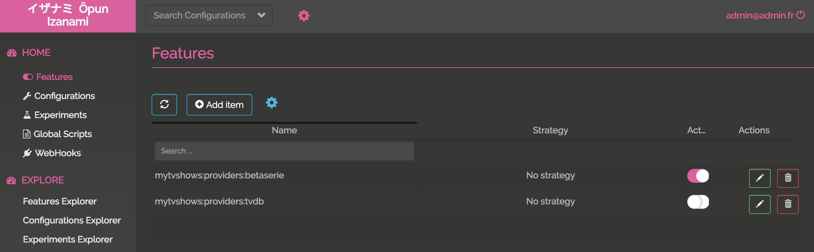
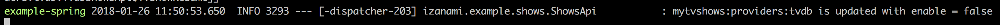
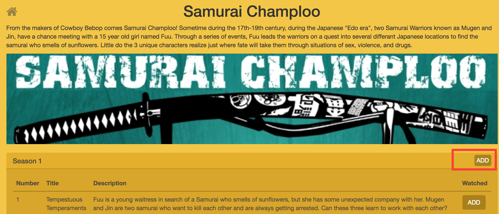
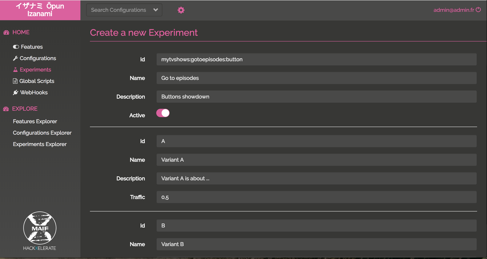
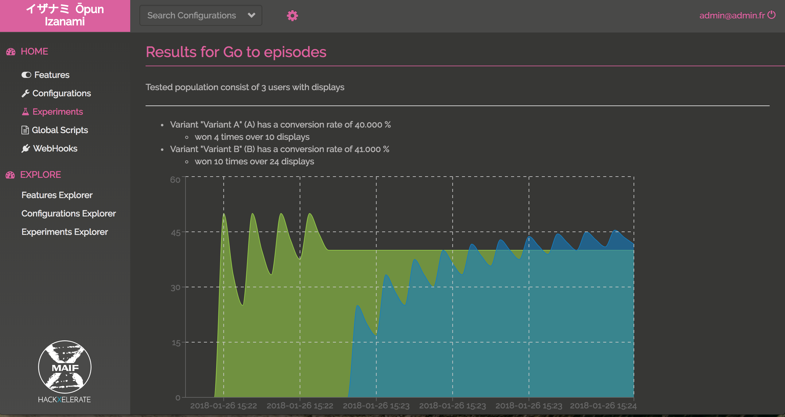

# Spring / React tutorial

@@toc { depth=3 } 

In this tutorial we're gonna see how to use Izanami in a springboot / react application. 

We're go to use the izanami-tryout (http://izanami-tryout.cleverapps.io) instance available online (thanks to [clever cloud](https://www.clever-cloud.com/)) to avoid running an instance on your machine.

@@@ warning
The "izanami-tryout" instance is reset frequently and should only be used to try Izanami and not for other purpose.  
@@@
  

## Overview of the example application 

This tutorial is based on an application that allow you to "mark as watched" the episodes of the tv shows you're watching. 

There is basically three big features in this app : 

* Search and select a tv show 
* Display the tv show you have selected 
* For a tv show, display seasons and episodes in order to mark the watched episodes


### Code organisation 

 
 

The code is organized as follow : 

* app : Global controller to serve the html and for login actions
* izanami : The proxy to the izanami server to expose izanami data to the client
* me : APIs and services concerning my tv shows and episodes  
* shows : APIs and services to search tv shows. Tv shows can come from multiple providers like tvdb or beta series. 
* Application.java : This is the root class of the application

### Running the application 

To run the application, you will need 

* JDK 8 : http://www.oracle.com/technetwork/java/javase/downloads/jdk8-downloads-2133151.html
* sbt : http://www.scala-sbt.org/download.html
* Node js : https://nodejs.org/en/download/ 
* Yarn : https://yarnpkg.com/lang/en/docs/install/ 

Let's start by cloning Izanami : 

```bash
git clone https://github.com/MAIF/izanami.git --depth=1
```

Then we have to compile and run the js/react code 

```
cd example/example-spring/javascript
yarn install 
yarn start 
```

Now there is a webpack server waiting to refresh the browser when the code change. 

Let's run the server side : 

```bash
sbt 'project example-spring' ';clean;~reStart'
```

Like on the client side, the server will be restarted automatically when your code will change. 

Now just open your browser and go to http://localhost:8080/

You can log with any email : 

 

Then search a show  


Select it 


Go to the episodes to add the watched ones 


## Step one : Configuring the java client 

To use Izanami, you first need to instantiate a client.

In this example, we're going to use the izanami tryout instance (http://izanami-tryout.cleverapps.io) deployed on [clever cloud](https://www.clever-cloud.com/).

The instance is configured on the `src/main/resources/application.yml` file : 

```yaml 
izanami:
  host: "http://izanami-tryout.cleverapps.io"
  clientId: "xxxx"
  clientSecret: "xxxx"
``` 

And the client is registered as spring bean like this : 

```java 
@SpringBootApplication
public class Application {

    @Autowired
    Environment environment;
    
    @Bean
    ActorSystem actorSystem() {
        return ActorSystem.create();
    }

    @Bean
    @Autowired
    IzanamiClient izanamiClient(ActorSystem actorSystem) {
        String host = environment.getProperty("izanami.host");
        String clientId = environment.getProperty("izanami.clientId");
        String clientSecret = environment.getProperty("izanami.clientSecret");
        LOGGER.info("Creating izanami client with host {}, client id {}", host, clientId);
        return IzanamiClient.client(
                    actorSystem,
                    ClientConfig
                        .create(host) // The url of the server 
                        .withClientId(clientId) // The client id of the api 
                        .withClientSecret(clientSecret) // The client secret of the api                    
                        .withDispatcher("izanami-example.blocking-io-dispatcher") // To handle blocking calls 
                        .sseBackend() // To be notified when there is change on the server 
                );
    }
}
```

The client is based on [Akka](https://akka.io/) so you have to provide an `ActorSystem` to make it work. 

Now we have to create a `FeatureClient` in order to use feature flipping. 

In this example we use two spring profiles 
* `izanamiLocal`: Use on fallback from config and never call the server. You can use it during development if you don't an available Izanami instance.   
* `izanamiProd` : This profile will use a real Izanami server instance.

So for `FeatureClient` we have two configs : 

```java 
    
    @Configuration
    @Profile("izanamiLocal")
    static class Dev {
        @Bean
        @Autowired
        FeatureClient featureClientDev(IzanamiClient izanamiClient, Environment environment) {
            String json = environment.getProperty("izanami.fallback.features");
            LOGGER.info("Loading feature fallback \n{}", json);
            return izanamiClient.featureClient(
                    Strategies.dev(), // The dev strategy use only fallback 
                    Features.parseJson(json)
            );
        }
    }
    
    @Configuration
    @Profile("izanamiProd")
    static class Prod {
        @Bean
        @Autowired
        FeatureClient featureClient(IzanamiClient izanamiClient, Environment environment) {
            return izanamiClient.featureClient(
                    Strategies.smartCacheWithSseStrategy("mytvshows:*"),
                    Features.parseJson(environment.getProperty("izanami.fallback.features"))
            );       
    }
```

The fallback is read from the config file : 

```yaml
izanami:
  // ...
  fallback:
    features: >
      [
        { "id": "mytvshows:season:markaswatched", "enabled": true },
        { "id": "mytvshows:providers:tvdb", "enabled": true },
        { "id": "mytvshows:providers:betaserie", "enabled": false },
        { "id": "mytvshows:providers:omdb", "enabled": false }
      ]
```

@@@ note

It's important to configure a fallback in case the server is not available. 

@@@


## Step two : feature flipping to switch the providers  

The application integrate multiple providers in order to search a tvshow. We want to be able to switch the providers for some reason. 

We will first define keys for each providers : 

* `mytvshows:providers:tvdb` : for tvdb 
* `mytvshows:providers:betaserie`: for betaserie
 
As you can see the keys are arborescent. We first have `mytvshows` to categorize the app then `providers` and then the name of the provider. 

This is a recommended pattern because
 
* it will facilitate the keys administration 
* it allows the application to keep track of updates while limiting the amount of datas.   

As seen in the previous chapter, the features are declared as fallback in configuration file. Now let's create this features on the server. 

Go to http://izanami-tryout.cleverapps.io/ and log in with `admin` / `admin123`. 

Click the "features" menu  


and click "Add Item" to add your key :


Now your keys are created and enabled 


We now have to handle this in our application. The `ShowsApi` class exposes two methods : 

* `search` : to search a show 
* `get` : to get a show, this seasons and episodes

Let's inject, the `FeatureClient`, `TvdbShowsApi` (to dialog with tvdb) and `BetaSerieApi` (to dialog with betaseries) : 

```java
public class ShowsApi implements Shows {

    private final static Logger LOGGER = LoggerFactory.getLogger(ShowsApi.class);

    private final FeatureClient featureClient;

    private final TvdbShowsApi tvdbShowsApi;

    private final BetaSerieApi betaSerieApi;

    @Autowired
    public ShowsApi(FeatureClient featureClient, TvdbShowsApi tvdbShowsApi, BetaSerieApi betaSerieApi) {
        this.featureClient = featureClient;
        this.tvdbShowsApi = tvdbShowsApi;
        this.betaSerieApi = betaSerieApi;        
    }
    // ...
}
``` 

Now we can implement the `search` and `get` methods delegating the work on providers : 

```java
@Override
public List<ShowResume> search(String serie) {
    Features features = this.featureClient.features("mytvshows:providers:*").get();
    if (features.isActive("mytvshows:providers:tvdb")) {
        return tvdbShowsApi.search(serie);
    } else if (features.isActive("mytvshows:providers:betaserie")) {
        return betaSerieApi.search(serie);
    } else {
        return List.empty();
    }
}

@Override
public Option<Show> get(String id) {
    Features features = this.featureClient.features("mytvshows:providers:*").get();
    if (features.isActive("mytvshows:providers:tvdb")) {
        return tvdbShowsApi.get(id);
    } else if (features.isActive("mytvshows:providers:betaserie")) {
        return betaSerieApi.get(id);
    } else {
        return Option.none();
    }
}
``` 

To be aware of what is happening, we had this code on the constructor to log Izanami events : 

```java
@Autowired
public ShowsApi(FeatureClient featureClient, TvdbShowsApi tvdbShowsApi, BetaSerieApi betaSerieApi) {
    this.featureClient = featureClient;
    this.tvdbShowsApi = tvdbShowsApi;
    this.betaSerieApi = betaSerieApi;
    // Here a callback is invoked when there is change on the Izanami server side : 
    featureClient.onEvent("mytvshows:providers:*", event -> {
        Match(event).of(
                Case($(instanceOf(FeatureEvent.FeatureCreated.class)), c -> {
                    LOGGER.info("{} is created with enable = {}", c.feature().id(), c.feature().enabled());
                    return Done.getInstance();
                }),
                Case($(instanceOf(FeatureEvent.FeatureUpdated.class)), c -> {
                    LOGGER.info("{} is updated with enable = {}", c.feature().id(), c.feature().enabled());
                    return Done.getInstance();
                }),
                Case($(instanceOf(FeatureEvent.FeatureDeleted.class)), c -> {
                    LOGGER.info("{} is deleted", c.id());
                    return Done.getInstance();
                })
        );
    });
} 
```

If we search for a show, the provider will be tvdb : 


Let's disable tvdb on Izanami : 



We can see this on the log thanks to server sent event : 




Now if we refresh the page and search : 


The provider is betaserie 

## Step three : feature flipping on the client side

On this step we're gonna flip on a button. 
The product team has developed a new feature that was pushed on the master branch but the team don't want to activate it right now.

### Create a proxy

To use feature flipping on the client side we have to use a proxy. 
To call Izanami APIs you need to provide authentication keys and we don't the keys to be exposed on the client side. 

Don't panic, the Izanami client provide a configurable proxy you can easily integrate in you application.    

First let's create the proxy in the `Application.java` spring configuration class : 

```java
@Bean
@Autowired
Proxy proxy(IzanamiClient izanamiClient, FeatureClient featureClient, ExperimentsClient experimentClient) {
    return izanamiClient.proxy()
            .withFeaturePattern("mytvshows:*") // We will expose the features matching this pattern. 
            .withFeatureClient(featureClient);
}
```

And then expose the features with the `izanami.example.izanami.IzanamiController` :

```java
@RestController
@RequestMapping("/api/izanami")
public class IzanamiProxyController {

    private final Proxy proxy;

    @Autowired
    public IzanamiProxyController(Proxy proxy) {
        this.proxy = proxy;
    }


    @GetMapping()
    public CompletionStage<ResponseEntity<String>> proxy(
            @CookieValue(value = "userId", required = false) String userId) {
        
        //We pass no context and no user id needed for experiments. 
        return proxy.statusAndStringResponse(Option.none(), Option.none())
                .map(resp -> // The resp is a pair (status code, response body)
                        new ResponseEntity<>(resp._2, HttpStatus.valueOf(resp._1))
                ).toCompletableFuture();
    }
}
```

The context is exposed on `GET /api/izanami`

That it! Now let's see what's happening on the client side.  

### Integrate Izanami with React

First install the client lib : 

```bash
yarn add react-izanami
```

And then configure Izanami. We will wrap the application inside the `IzanamiProvider` react component : 

```jsx
import {IzanamiProvider} from 'react-izanami';

// ...

const IzanamiApp = props => (
  <IzanamiProvider fetchFrom="/api/izanami">
    <Router basename="/">
        <Switch>
          <Route path="/login" component={Login}/>
          <PrivateRoute path="/" component={MainApp}/>
        </Switch>
    </Router>
  </IzanamiProvider>
);

export function init(node) {
  ReactDOM.render(<IzanamiApp />, node);
}
```

As you can see, we set the `fetchFrom` props with the proxy API we've exposed just before. 
When the IzanamiProvider will be mounted, the features will be fetched in order to display or not the related components.


The product team has developed the ability to mark an entire season as watched. 
This code is located in the `pages/TvShow.js` file. 

The key `mytvshows:season:markaswatched` will be used : 

```jsx 
import {Feature, Enabled, Disabled} from 'react-izanami';

// ...

<Feature path={"mytvshows:season:markaswatched"}>
  <Enabled>
    {s.allWatched && <button onClick={this.markSeasonWatched(s.number, false)} className="btn btn default pull-right addBtn"><i className="glyphicon glyphicon-ok"/></button>}
    {!s.allWatched && <button  onClick={this.markSeasonWatched(s.number, true)} className="btn btn default pull-right addBtn"> ADD </button>}
  </Enabled>
  <Disabled>
    <div></div>
  </Disabled>
</Feature>  
```

Verify the key `mytvshows:season:markaswatched` is define in the fallback config. 
Then create the feature on the Izanami server instance. Keep the feature deactivated for the moment. 


If you take a look at the network panel on the developers tools when you load the page, 
you can see that there is a call on `/api/izanami` with the following response : 

```javascript
{
  experiments: {},
  features: {
    mytvshows: {
      providers: {
        tvdb: {
          active: true
        },
        betaserie: {
          active: true
        },
        omdb: {
          active: false
        }
      },
      season: {
        markaswatched: {
          active: false
        }
      }
    }
  },
  configurations: {}
}
``` 
The feature `mytvshows:season:markaswatched` is not enabled. 


Go to the Izanami server, activate the feature and reload the page 




## Step four : A/B testing

Congrats! You've almost reached the end of this tutorial. The last step is to measure the best of two button using A/B testing.

In this section, we will provide two variants of the same button : variant A and variant B and see which the better. 


To do that we have to 

* Define a fallback for our experiment  
* Create the ExperimentsClient on the server side
* Add new routes to the proxy
* Define the button on the client side. 

### The spring plumbing

Like for the features, let's define the `ExperimentsClient` in the `Application.java` class: 

For the dev 

```java

@Configuration
@Profile("izanamiLocal")
static class Dev {
    // ... 
    @Bean
    @Autowired
    ExperimentsClient experimentClient(IzanamiClient izanamiClient, Environment environment) {
        String json = environment.getProperty("izanami.fallback.experiments");
        LOGGER.info("Loading configs fallback \n{}", json);
        return izanamiClient.experimentClient(
                Strategies.dev(),
                Experiments.parseJson(json)
        );
    }

}
```
For the prod 

```java
@Configuration
@Profile("izanamiProd")
static class Prod {
    // ... 
    @Bean
    @Autowired
    ExperimentsClient experimentClient(IzanamiClient izanamiClient, Environment environment) {

        return izanamiClient.experimentClient(
                Strategies.fetchStrategy(),
                Experiments.parseJson(environment.getProperty("izanami.fallback.experiments"))
        );
    }
}
```
And the fallback configuration is the following : 

```yaml
izanami:
  // ...
  fallback:
    // ...
    experiments: >
      [
        {
          "id": "mytvshows:gotoepisodes:button",
          "name": "Test button",
          "description": "Test button",
          "enabled": true,
          "variant": {
            "id": "A",
            "name": "Variant A",
            "description": "Variant A"
          }
        }
      ]
```

Here we define an experiment with the default variant (A). 


The proxy config should be changed too in order to add the experiments client : 

```java
@Bean
@Autowired
Proxy proxy(IzanamiClient izanamiClient, FeatureClient featureClient, ExperimentsClient experimentClient) {
    return izanamiClient.proxy()
            .withFeaturePattern("mytvshows:*")
            .withFeatureClient(featureClient)
            .withExperimentPattern("mytvshows:*")
            .withExperimentsClient(experimentClient);
}
```

In the previous chapter the proxy controller was 

```java
@GetMapping()
public CompletionStage<ResponseEntity<String>> proxy(
        @CookieValue(value = "userId", required = false) String userId) {
         
    return proxy.statusAndStringResponse(Option.none(), Option.none())
            .map(resp -> // The resp is a pair (status code, response body)
                    new ResponseEntity<>(resp._2, HttpStatus.valueOf(resp._1))
            ).toCompletableFuture();
}
```

Now we need to pass something to Izanami to identify the current user/session in order to get the right variant (A or B).
We will use the userId cookie used by the app to identify the current user :  

```java
@GetMapping()
public CompletionStage<ResponseEntity<String>> proxy(
        @CookieValue(value = "userId", required = false) String userId) {
    
    //The user id needed for experiments 
    return proxy.statusAndStringResponse(Option.none(), Option.of(userId))
            .map(resp -> // The resp is a pair (status code, response body)
                    new ResponseEntity<>(resp._2, HttpStatus.valueOf(resp._1))
            ).toCompletableFuture();
}
```

Now if we hit the `GET /api/izanami` API in the browser, the response will be 

```javascript
{
  experiments: {
    mytvshows: {
      gotoepisodes: {
        button: {
          variant: "A"
        }
      }
    }
  },
  features: {
    mytvshows: {
      providers: {
        tvdb: {
          active: false
        },
        betaserie: {
          active: true
        },
        omdb: {
          active: false
        }
      },
      season: {
        markaswatched: {
          active: false
        }
      }
    }
  },
  configurations: {}
}
```

For the moment the variant come from the callback because we haven't already define the experiment in Izanami. 

### Add routes to the proxy 

Now, the spring beans are created, we can enrich the proxy controller to expose more routes: 

```java
@PostMapping("/experiments/displayed")
public CompletionStage<ResponseEntity<String>> markDisplayed(
        @RequestParam(value = "experiment") String id,
        @CookieValue(value = "userId") String userId) {

    return proxy.markVariantDisplayedStringResponse(id, userId)
            .map(resp ->
                    new ResponseEntity<>(resp._2, HttpStatus.valueOf(resp._1))
            ).toCompletableFuture();
}

@PostMapping("/experiments/won")
public CompletionStage<ResponseEntity<String>> markWon(
        @RequestParam(value = "experiment") String id,
        @CookieValue(value = "userId", required = false) String userId) {

    return proxy.markVariantWonStringResponse(id, userId)
            .map(resp ->
                    new ResponseEntity<>(resp._2, HttpStatus.valueOf(resp._1))
            ).toCompletableFuture();

}
```

To measure which of the two variants is the more appreciated, we need to push events to the Izanami server. 
This is why we expose this two routes : 

* `/api/izanami/experiments/displayed` will create an event when a button is displayed 
* `/api/izanami/experiments/won` will create an event when a button is clicked 

The set up on server side is done, let's work on the client side. 

### The A/B testing with react

The tested button is the link to access the episodes for a show :  


The client side is on the `pages/MyTvshows.js` file. 

First let's import some component : 

```jsx 
import {Experiment, Variant} from 'react-izanami';
``` 

And then the code for the button : 

```jsx
<Experiment path={"mytvshows:gotoepisodes:button"} notifyDisplay="/api/izanami/experiments/displayed" >
    <Variant id={"A"}>
      <Link to={`/tvshow/${id}`} onClick={this.markAsWon} className="btn pull-right" alt="consulter"><i className="fa fa-eye"></i></Link>
    </Variant>
    <Variant id={"B"}>
      <Link to={`/tvshow/${id}`} onClick={this.markAsWon} className="btn pull-right" alt="consulter"><i className="glyphicon glyphicon-chevron-right"></i></Link>
    </Variant>
</Experiment>
```

We have to set the following props on the `Experiment` component : 

* `path`: The key of the experiment 
* `/api/izanami/experiments/displayed`: The api to call when the component is displayed 

And for the `Variant` the props `id` with the id of the variant. 

It remains a thing to do. We need to tell Izanami when a variant won. In our case the button won if we click on it. 
To do this we set the `onClick` props to call the server when a click is done. 

The `markAsWon` method : 

```jsx
markAsWon = () => {
    Service.notifyWon("mytvshows:gotoepisodes:button");
};
```

The `notifyWon` method :

```jsx
export function notifyWon(key) {
  return fetch(`/api/izanami/experiments/won?experiment=${key}`, {
    method: 'POST',
    credentials: 'include',
    headers: {
      'Accept': 'application/json',
      'Content-Type': 'application/json'
    }
  });
}
```

That it !!! 

Let's create the experiment on the Izanami server 



Ok the experiment is created


If I go the app using the user `floki@gmail.com`, I got the variant A 


And with the user `ragnar.lodbrock@gmail.com`, I got the variant B
  


After clicking multiple times on the buttons, the results are 

 


Congrats !!! You have win your first belt.  
