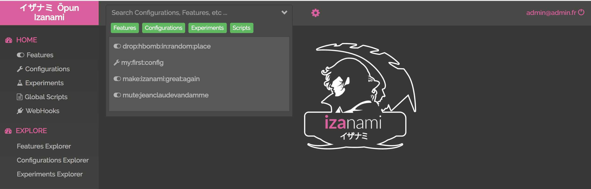

# UI usage

@@toc { depth=3 }

## Global search 

On the top of the screen you can quick search and access "features", "configurations", "experiments" or "global script". 

The search can be refined by clicking the buttons: 

Clicking one item will bring you to the edit page of the selected item.  

## Features 

Visit to the @ref[features UI doc](features/ui.md) 

## Configurations 

Visit to the @ref[features UI doc](configs/ui.md)

## Experiments (A/B testing)

Visit to the @ref[experiments UI doc](experiments/ui.md)

## Scripts 

* TODO

## Webhooks

* TODO

## Manage users  

* TODO

## Manage API keys  

* TODO